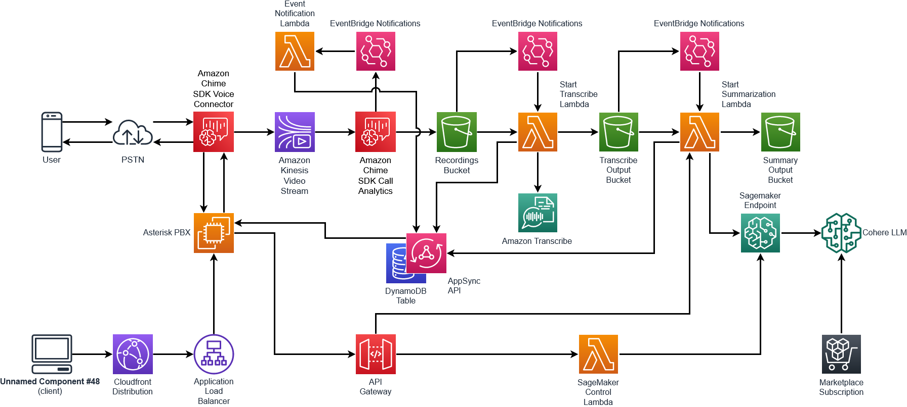
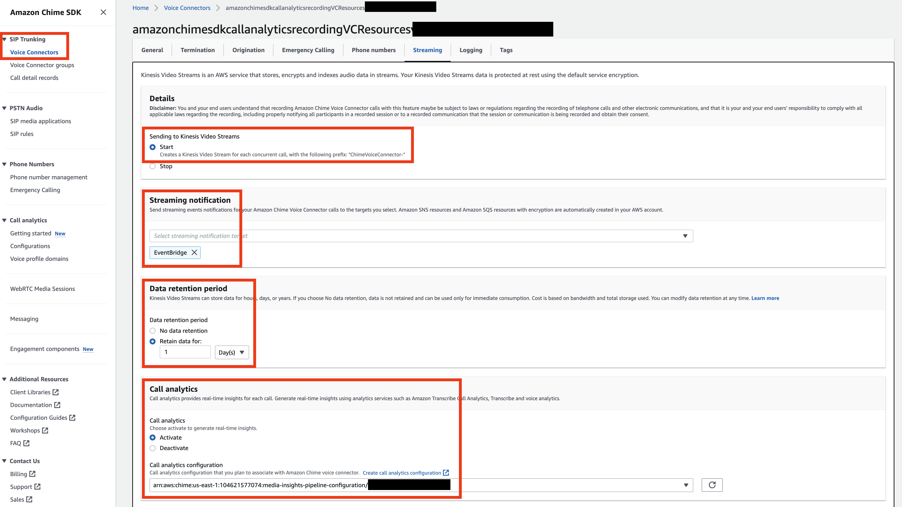
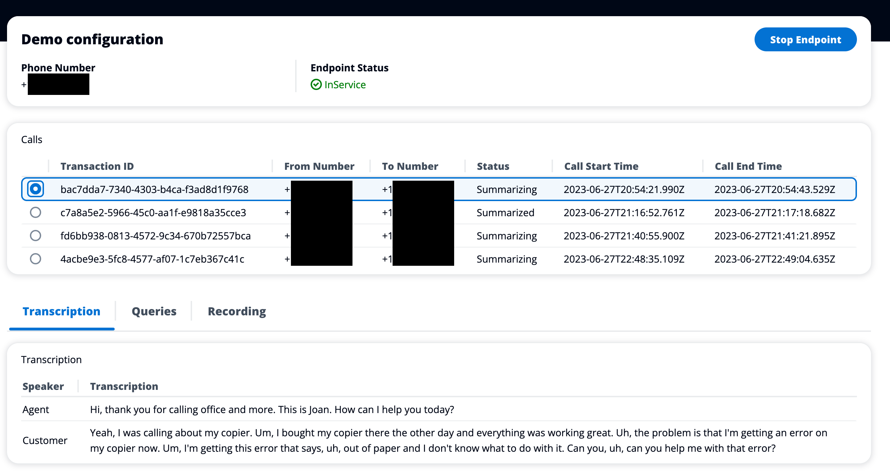
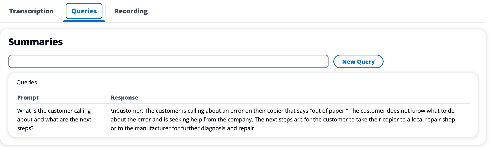

## Amazon Chime SDK Call Analytics Recorder with Summarization

This demo will configure and deploy an example of a call recording application using the Amazon Chime SDK Call Analytics Media Insights Pipeline feature. Additionally, this demo will produce a call summarization using the transcription of the call.



### Amazon Chime SDK Call Analytics

Amazon Chime SDK call analytics allows you to develop low-code solutions for real-time audio workloads. In this example, we will be creating a mechanism to record calls using an [Amazon Chime Voice Connector](https://docs.aws.amazon.com/chime-sdk/latest/ag/voice-connectors.html) as either a Public Switched Telephone Network (PSTN) Session Initiation Protocol (SIP) trunk, or as a SIPREC SIP trunk. If you don't have a device capable of generating SIPREC traffic, you can still deploy this demo and an Asterisk server will be deployed so that you can make calls to that.

## Prerequisites

- AWS Account and credentials
- Basic understanding of SIP telephony
- Node >v16
- Docker running

### Optional

- SIPREC capable telephony

## How It Works

In this demo, all calls to the created Amazon Chime SDK Voice Connector will be recorded and stored in an Amazon Simple Storage Service (S3) Bucket. These objects will be stored with a prefix of the Amazon Chime SDK Voice Connector ID. Once the recording is completed, it will be transcribed using Amazon Transcribe. Once this is completed, the transcription will be used to generate a summarization of the call.

### Configuration

To enable recording with an Amazon Chime SDK call analytics configuration associated with an Amazon Chime SDK voice connector, you must:

- Create an S3 bucket
- Create an AWS Identity and Access Management (IAM) role
- Create an Amazon Chime SDK call analytics configuration using the previously created bucket and role
- Create an Amazon Chime SDK Voice Connector
- Enable streaming on the Amazon Chime SDK Voice Connector
- Associate the Amazon Chime SDK call analytics configuration with the previously created Amazon Chime SDK Voice Connector

Deploying this demo will complete all of these steps for you but they can be completed by AWS Console or AWS Command Line Interface (AWS CLI) as well.

#### Call analytics configuration


In this example, we have created an Amazon Chime SDK Call analytics configuration with recording enabled, an AWS Identity and Access Management (IAM) role associated with it, and an S3 bucket location that will be used to store the objects.

#### Streaming Configuration



Next, we will deploy and configure an Amazon Chime SDK voice connector with Streaming enabled, a notification target of `EventBridge`, 24 hours of data retention, and the previously created Call analytics configuration associated. These settings will allow us to capture the Real-time Transport Protocol (RTP) packets and store them in an S3 bucket as a WAV or OGG file.

#### Voice Connector Options

This demo will be deployed using an Amazon Chime SDK Voice Connector configured to use PSTN access. Amazon Chime SDK voice connectors can also be configured to use [SIPREC](https://docs.aws.amazon.com/chime-sdk/latest/ag/start-kinesis-vc.html#siprec). If you have a device capable of generating SIPREC data, More information on configuring your SIP endpoint can be found [here](https://aws.amazon.com/chime/chime-sdk/resources/) in the `Configuration Guides` section.

## Call Summarization

This demo also includes an automatic call summarization component that can be used to process the recorded files with a large language model to generate insights into the content of that call.

### Getting started

This demo uses a Cohere Generate Model that is available in the [AWS Marketplace](https://aws.amazon.com/marketplace/pp/prodview-6dmzzso5vu5my). In order to use this demo, you will need to subscribe to this product. This demo uses this model through a SageMaker endpoint. In order to use this model with SageMaker, you will need access to [`Foundation models`](https://us-east-1.console.aws.amazon.com/sagemaker/home?region=us-east-1#/foundation-models) in the SageMaker `JumpStart` section. Once these steps have been completed, you will be able to use this demo.

## How it works

### Start Transcribe

When a new files is added to the output bucket, either through the recording mechanism of the recording demo or through a manual upload, the `OBJECT_CREATED` event triggers the `startTranscribe` AWS Lambda function.

```python
    transcribe.start_transcription_job(
        TranscriptionJobName=job_name,
        Media={'MediaFileUri': f's3://{bucket}/{key}'},
        Settings= {"ShowSpeakerLabels": True, "MaxSpeakerLabels":2},
        MediaFormat=media_format,
        LanguageCode='en-US',
        OutputBucketName=OUTPUT_BUCKET,
        OutputKey=output_key
    )
```

This will create a JSON object in the `OUTPUT_BUCKET` that we will use for the next step.


[This](/samples/Retail41.json) is an example of the output from Amazon Transcribe with the [`Retail41.wav`](/samples/Retail41.wav) as the input.

We will need to process this JSON file before passing to our SageMaker endpoint for summarization.

## Summarization Process

Once the transcription has completed, the output file will be stored in the `OUTPUT_BUCKET`. When this happens, the `startSummarization` app that will process the JSON file created by Amazon Transcribe and create a prompt that will be delivered to our SageMaker endpoint to be processed by our Cohere model.

The prompt that is passed to our SageMaker endpoint can be seen in the [SummarizationOutput](/samples/31a62a1d-5dab-4b8d-8f17-1dad22c6f075.json) file. This is the result of processing the Transcribe output into something more suitable for our Cohere request. We will then combine this with our question to produce the following:

#### Question

"What is the customer calling about and what are the next steps?",

#### Summary

"The customer is calling Office and More to report an issue with their copier. The copier is giving an error message saying the copier quantity limit has been reached, but the customer believes they have unlimited copies with their rental. The customer is unable to print something they need for a project and needs assistance amending the contract. The customer is also asking about the next steps to resolve the issue. The customer service representative will need to speak with the appropriate person to amend the contract and provide the customer with the correct contact information. The customer will need to provide the customer service representative with the model number of the copier and the name of the business. The customer service representative will then look into the issue and try to resolve it as quickly as possible.",

## Testing It Out

To test this demo, navigate to the Cloudfront Distribution webpage included in the output of the CDK.

If 'Endpoint Status' shows as 'Endpoint disabled', click on 'Start Endpoint' to enable the SageMaker endpoint (This could take few mins to enable). Once 'Endpoint Status' shows as 'InService', you are ready to test.

> **Attention** This deployment includes Amazon SageMaker endpoint which you incur additional charges when you start the SageMaker endpoint. We recommend you to stop the Amazon SageMaker endpoint by clicking on the 'Stop Endpoint' button once finished with the experiment to avoid unexpected charges. See [Amazon SageMaker pricing](https://aws.amazon.com/sagemaker/pricing/) for relevant costs.

Make a call to the phone number that is provided as part of the CDK output. This call will be answered on the Asterisk server and a recording will be played simulating a call to an office supply store. If you are using SIPREC instead, make a call through your telephony devices and make a SIPREC request to the Amazon Chime SDK voice connector.

### Results

#### S3 Bucket


The result will be a `wav` file stored in your S3 Bucket with a filename of the `[detail]['callId']`.

#### User Interface



Using this user interface, you can see the transcription, queries, and play the recording audio file.

### Queries



New queries can be made to the same SageMaker endpoint using the existing transcription to explore what can be learned from the call.

## More Information

For more information or to use this demo through a notebook instead of in a deployed application: [https://github.com/aws-samples/amazon-chime-sdk-notebooks](https://github.com/aws-samples/amazon-chime-sdk-notebooks)

## Deployment

### Options

Several options are available as part of the deployment and can be configured in the `.env` file. All are optional.

- LOG_LEVEL - Used to assist with debugging in the Lambda function and Asterisk instance. 'INFO' | 'DEBUG' | 'WARN' | 'ERROR'. Defaults to 'INFO'.
- PUBLIC_SSH_KEY - A key deployed to the server as an `authorized_key`.
- CREATE_SAGEMAKER_ON_START - Used to control if the SageMaker endpoint is created when the CDK is deployed. 'true' | 'false' - Defaults to 'false'

Configurations for Large Language Model (LLM) - It is unlikely that you will need to change these.

- MODEL_NAME - 'deployed-cohere-gpt-medium'
- ENDPOINT_NAME - 'deployed-cohere-gpt-medium'
- COHERE_INSTANCE_TYPE - ml.g5.xlarge'
- MODEL_PACKAGE_ARN - 'arn:aws:sagemaker:us-east-1:865070037744:model-package/cohere-gpt-medium-v1-5-15e34931a06235b7bac32dca396a970a

### To Deploy

This demo will use an AWS Cloud Development Kit (AWS CDK) to deploy. To start the deployment:

```
yarn launch
```

When finished, be sure to destroy any unneeded resources. You can destroy the entire demo:

```
yarn cdk destroy
```
