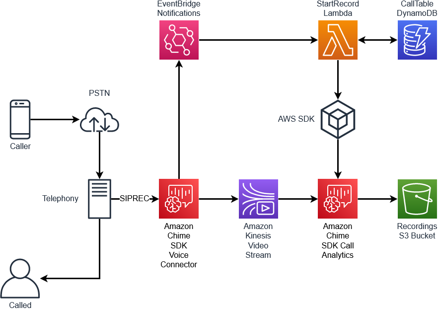

## Amazon Chime SDK Call Analytics Recorder

This demo will configure and deploy an example of a call recording application using the Amazon Chime SDK Call Analytics Media Insights Pipeline feature.

### Amazon Chime SDK Call Analytics

Amazon Chime SDK call analytics allows you to develop low-code solutions for real-time audio workloads. In this example, we will be creating a mechanism to record calls using an [Amazon Chime Voice Connector](https://docs.aws.amazon.com/chime-sdk/latest/ag/voice-connectors.html) as either a Public Switched Telephone Network (PSTN) Session Initiation Protocol (SIP) trunk, or as a SIPREC SIP trunk. If you don't have a device capable of generating SIPREC traffic, you can still deploy this demo and an Asterisk server will be deployed so that you can make calls to that.

#### SIPREC Option



#### Asterisk Option


## Prerequisites

- AWS Account and credentials
- Basic understanding of SIP telephony
- Node >v16
- Docker running

### Optional

- Output Bucket
- SIPREC capable telephony

## How It Works

### Streaming Configuration

This demo will deploy and configure an Amazon Chime SDK voice connector to enable Streaming with a notification target of `EventBridge` and 24 hours of data retention. These settings will allow us to capture the Real-time Transport Protocol (RTP) packets and store them in an Amazon Simple Storage Service (S3) Bucket.


### EventBridge Notification

When the Amazon Chime SDK voice connector receives a call, either a PSTN based call, or SIPREC call, it will emit a notification to [Amazon EventBridge](https://aws.amazon.com/eventbridge/). In this demo, that notification will be sent to an AWS Lambda function that will process that notification. The notification will look something like this:

```json
{
  "version": "0",
  "id": "ac48f3fe-0b49-7b20-56af-bcefec745020",
  "detail-type": "Chime VoiceConnector Streaming Status",
  "source": "aws.chime",
  "account": "112233445566",
  "time": "2023-04-05T22:14:02Z",
  "region": "us-east-1",
  "resources": [],
  "detail": {
    "callId": "089b1d79-d4ca-4f74-b36b-681f606937f6",
    "direction": "Inbound",
    "fromNumber": "+18155551212",
    "isCaller": false,
    "mediaType": "audio/L16",
    "startFragmentNumber": "91343852333181437344442219794598596340754947404",
    "startTime": "2023-04-05T22:14:02.238Z",
    "streamArn": "arn:aws:kinesisvideo:us-east-1:112233445566:stream/ChimeVoiceConnector-bfggco08s5m5esgxfskzks-94709a8e-c2cc-4f92-9ab1-af74c54c041a/1680731924044",
    "toNumber": "+19285557777",
    "transactionId": "ec97a8ff-3f83-4de2-8d73-d988070f6af4",
    "voiceConnectorId": "bfggco08s5m5esgxfskzks",
    "streamingStatus": "STARTED",
    "version": "0"
  }
}
```

### Stored Data

There are several key pieces of information in this notification that we will need to capture and save:

```python
def put_item(call_id, stream_arn, is_caller, start_time):
    dynamodb.put_item(
        TableName=CALL_TABLE,
        Item={
            'call_id': {'S': call_id},
            'stream_arn': {'S': stream_arn},
            'is_caller': {'S': is_caller},
            'start_time': {'N': str(start_time)}
            }
    )
```

This Python function in the Lambda code will store the `call_id`, `stream_arn`, `is_caller`, and `start_time` of the call. When a call is streamed to [Amazon Kinesis Video Stream](https://aws.amazon.com/kinesis/video-streams/?amazon-kinesis-video-streams-resources-blog) from the Amazon Chime SDK voice connector, two separate streams are created. These streams contain the audio from the two media paths in a SIP call. `is_caller` is a calculated field that is used to differentiate the two streams and is not necessarily the actual caller. A single call will generate two notifications - one where `is_caller` is `true` and one where `is_caller` is `false`. We will capture the `stream_arn` of each of these streams and use that information later when the call is completed.

### Call Ends

When the call ends, two more notifications will be sent by EventBridge to our `StartRecord` Lambda function. These notifications will something like this:

```json
{
  "version": "0",
  "id": "acf0d318-d990-723a-53d8-bc3ace0f5741",
  "detail-type": "Chime VoiceConnector Streaming Status",
  "source": "aws.chime",
  "account": "112233445566",
  "time": "2023-04-05T22:14:17Z",
  "region": "us-east-1",
  "resources": [],
  "detail": {
    "callId": "089b1d79-d4ca-4f74-b36b-681f606937f6",
    "currentFragmentNumber": "91343852333181432457054944695917274706600548493",
    "direction": "Inbound",
    "endTime": "2023-04-05T22:14:17.788Z",
    "fromNumber": "+18155551212",
    "isCaller": true,
    "startFragmentNumber": "91343852333181432392682062653077497216055113817",
    "startTime": "2023-04-05T22:14:03.993Z",
    "streamArn": "arn:aws:kinesisvideo:us-east-1:112233445566:stream/ChimeVoiceConnector-bfggco08s5m5esgxfskzks-2d439d05-cb93-49b6-ba14-f4ac55017d57/1680731931114",
    "toNumber": "+19285557777",
    "transactionId": "ec97a8ff-3f83-4de2-8d73-d988070f6af4",
    "voiceConnectorId": "bfggco08s5m5esgxfskzks",
    "streamingStatus": "ENDED",
    "version": "0"
  }
}
```

The key difference here is that `[detail][streamingStatus]` is now `ENDED`. Now that we know that the call has ended, we can begin the process of extracting the media from the KVS streams and storing in our S3 Bucket.

### Retrieving Stream Information

```python
def get_streams(call_id):
    response = dynamodb.query(
        TableName=CALL_TABLE,
        KeyConditionExpression='call_id = :call_id',
        ExpressionAttributeValues={
            ':call_id': {'S': call_id}
            }
        )
    return response['Items'] if 'Items' in response else None
```

First, we will retrieve the information about the KVS stream ARNs we had previously stored in our Amazon DynamoDB table.

### Create Media Insight Pipeline

```python
caller_stream_arn = stream_arns[0]['stream_arn']['S']
not_caller_stream_arn = stream_arns[1]['stream_arn']['S']
start_time = stream_arns[0]['start_time']['N']
end_time = datetime.datetime.fromisoformat(event['detail']['endTime'][:-1])
destination = 'arn:aws:s3:::' + RECORDING_BUCKET + RECORDING_BUCKET_PREFIX + "/" + event['detail']['callId'] + '.wav'
response = media_pipelines.create_media_insights_pipeline(
    MediaInsightsPipelineConfigurationArn=MEDIA_INSIGHT_PIPELINE_ARN,
    KinesisVideoStreamRecordingSourceRuntimeConfiguration={
        "Streams": [
            {"StreamArn": caller_stream_arn},
            {"StreamArn": not_caller_stream_arn}
            ],
        "FragmentSelector": {
            "FragmentSelectorType": "ProducerTimestamp",
            "TimestampRange": {
                "StartTimestamp": int(start_time),
                "EndTimestamp": int(end_time.timestamp())
                },
            }
        },
    S3RecordingSinkRuntimeConfiguration={
        "Destination": destination,
        "RecordingFileFormat": "Wav"
    }
)
```

Using the stream ARNs, start time, and end time, we can call [`create_media_insights_pipeline`](https://boto3.amazonaws.com/v1/documentation/api/1.26.101/reference/services/chime-sdk-media-pipelines/client/create_media_insights_pipeline.html).

In this case, we are referencing a `MediaInsightsPipelineConfigurationArn` that was created as part of this demo as well as the S3 Bucket referenced in that configuration.


## Result


The result will be a `wav` file stored in your S3 Bucket with a filename of the `[detail]['callId]`.

## Deployment

### Options

Several options are available as part of the deployment and can be configured in the `.env` file. All are optional.

- OUTPUT_BUCKET - This will control where the output files are stored. If this is not included, a new Bucket will be created.
- RECORDING_BUCKET_PREFIX - This will control if an Bucket prefix is used when storing the output files. Defaults to no prefix.
- BUILD_ASTERISK - This will determine if an Asterisk instance will be created during the deployment. This cannot be used with SIPREC_CIDRS. Defaults to 'true'.
- SIPREC_CIDRS - These will be used if you are not deploying an Asterisk server and instead want to use their existing telephony to generate SIPREC traffic. They should use a comma separate string format: `'198.51.100.0/27','198.51.100.128/27'`.
- LOG_LEVEL - Used to assist with debugging in the Lambda function and Asterisk instance. 'INFO' | 'DEBUG' | 'WARN' | 'ERROR'. Defaults to 'INFO'.
- REMOVAL_POLICY - Used to control the removal policy of the new S3 Bucket that is created. Valid options: 'DESTROY' | 'RETAIN' | 'SNAPSHOT'. Defaults to 'DESTROY'

### To Deploy

This demo will use an AWS Cloud Development Kit (AWS CDK) to deploy. To start the deployment:

```
yarn launch
```

When finished, be sure to destroy any unneeded resources. You can destroy the entire demo:

```
yarn cdk destroy
```

If the default value for `REMOVAL_POLICY` is used, the output bucket will be destroyed and those files lost.

## Working with Post Call Analytics

A complementary demo that will work with this demo is the [Amazon Transcribe Post Call Analytics (PCA)](https://github.com/aws-samples/amazon-transcribe-post-call-analytics) demo. The PCA demo can be deployed to the same account as this demo and the output bucket of this demo can be used as the input bucket of the PCA demo. When used together like this, the files created by this demo will trigger the PCA demo to begin processing the file with [Amazon Transcribe](https://aws.amazon.com/transcribe/) or [Amazon Transcribe Call Analytics](https://aws.amazon.com/transcribe/call-analytics/).

To use this demo with PCA, be sure to set your `.env` variables to include the input bucket from PCA as the `OUTPUT_BUCKET` and use `originalAudio` for `RECORDING_BUCKET_PREFIX`.

## Additional Notes

### Using AWS CLI

If you do not wish to deploy this demo using CDK, AWS Command Line Interface can be used. An overview of the commands required is available here: [CLI_COMMANDS](./CLI_COMMANDS.md)

### Lambda function

Because this uses commands that may not be available in all Lambda runtimes, the demo bundles a version of the AWS SDK that supports `create_media_insights_pipeline`. If you wish to use a different Lambda function or language, be sure to include a runtime that supports this or bundle a version of the AWS SDK that does.
