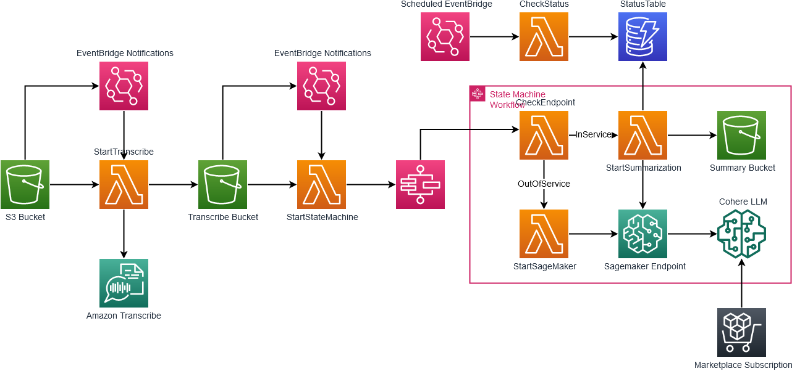

# Automatic Call Summarization

[This demo](./) also includes an option to deploy an automatic call summarization component. This will allow you to process the output of the recorded files and use them to quickly gain insight the contents of the call.

## Prerequisites

- Included recording demo deployed
- Docker running
- Amazon SageMaker Foundation models access
- Cohere Generate Model - Command Medium access

### Getting started

This demo uses a Cohere Generate Model that is available in the [AWS Marketplace](https://aws.amazon.com/marketplace/pp/prodview-6dmzzso5vu5my). In order to use this demo, you will need to subscribe to this product. This demo uses this model through a SageMaker endpoint. In order to use this model with SageMaker, you will need access to [`Foundation models`](https://us-east-1.console.aws.amazon.com/sagemaker/home?region=us-east-1#/foundation-models) in the SageMaker `JumpStart` section. Once these steps have been completed, you will be able to use this demo.

## Overview



This demo will complement the previously deployed recording demo. In that demo, we created audio files and stored them in an S3 bucket. In this demo, we will be taking those objects and processing them using Amazon Transcribe and Amazon SageMaker to produce a summarization of the call.

This demo also includes a mechanism to turn off the SageMaker endpoint when not in use. If the SageMaker endpoint is not used for ~20 minutes it will be stopped. Be sure to verify that this is working to avoid excess charges. Re-starting this service can take ~15 minutes and will be done automatically when a new file is added.

## How it works

### Start Transcribe

When a new files is added to the output bucket, either through the recording mechanism of the recording demo or through a manual upload, the `OBJECT_CREATED` event triggers the `startTranscribe` AWS Lambda function.

```python
    transcribe.start_transcription_job(
        TranscriptionJobName=job_name,
        Media={'MediaFileUri': f's3://{bucket}/{key}'},
        Settings= {"ShowSpeakerLabels": True, "MaxSpeakerLabels":2},
        MediaFormat=media_format,
        LanguageCode='en-US',
        OutputBucketName=OUTPUT_BUCKET,
        OutputKey=output_key
    )
```

This will create a JSON object in the `OUTPUT_BUCKET` that we will use for the next step.


[This](/samples/Retail41.json) is an example of the output from Amazon Transcribe with the [`Retail41.wav`](/samples/Retail41.wav) as the input.

We will need to process this JSON file before passing to our SageMaker endpoint for summarization.

### Start State machine

To control when the SageMaker endpoint is in use, we will use an AWS Step Function.


This Step Function will check to see if the SageMaker Endpoint is active. If it is not, it will start it, otherwise it will start the summarization process.

## Summarization Process

Included in this demo is the `startSummarization` app that runs as a Docker image Lambda function. This app will process the output created by Amazon Transcribe in the previous step and create a prompt that will be delivered to our SageMaker endpoint to be processed by our Cohere model.

The prompt that is passed to our SageMaker endpoint can be seen in the [SummarizationOutput](/samples/31a62a1d-5dab-4b8d-8f17-1dad22c6f075.json) file. This is the result of processing the Transcribe output into something more suitable for our Cohere request. We will then combine this with our question to produce the following:

```json
    "final_summary": "\nThe customer is calling Office and More to report an issue with their copier. The copier is giving an error message saying the copier quantity limit has been reached, but the customer believes they have unlimited copies with their rental. The customer is unable to print something they need for a project and needs assistance amending the contract. The customer is also asking about the next steps to resolve the issue. The customer service representative will need to speak with the appropriate person to amend the contract and provide the customer with the correct contact information. The customer will need to provide the customer service representative with the model number of the copier and the name of the business. The customer service representative will then look into the issue and try to resolve it as quickly as possible.",
    "question": "What is the customer calling about and what are the next steps?",
```

## Deploying

To deploy this demo:

```bash
yarn launchAll
```

## Cleanup

To destroy this demo:

```bash
yarn cdk destroy --all
```

or

```bash
yarn cdk destroy amazon-chime-sdk-call-analytics-summarization
```

## More Information

For more information or to use this demo through a notebook instead of in a deployed application: [https://github.com/aws-samples/amazon-chime-sdk-notebooks](https://github.com/aws-samples/amazon-chime-sdk-notebooks)
